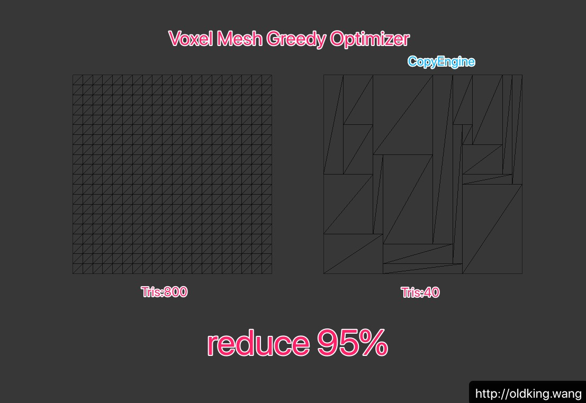

- 2022年08月27日

优化取值范围使用[BoundMin,BoundMax],无需上层函数再做虚拟坐标转换

---

# CEVoxelGreedyOptimizer

Use greedy algorithm to optimize voxel mesh (Minecraft like game)





---

Example

use greed logic to generate mesh in xz plane (y=0,normal is Vector3.up dir)

```csharp
 public Dictionary<Vector2Int, bool> mMarkDic = new();

        public Vector2Int BoundMin = new Vector2Int(int.MaxValue, int.MaxValue);
        public Vector2Int BoundMax = new Vector2Int(int.MinValue, int.MinValue);

        public void MarkTile(Vector2Int _index)
        {
            if (mMarkDic.ContainsKey(_index))
            {
                Debug.LogWarning("Already contain key " + _index);
                return;
            }

            mMarkDic.Add(_index, true);

            BoundMax.x = Mathf.Max(BoundMax.x, _index.x);
            BoundMax.y = Mathf.Max(BoundMax.y, _index.y);

            BoundMin.x = Mathf.Min(BoundMin.x, _index.x);
            BoundMin.y = Mathf.Min(BoundMin.y, _index.y);

            Debug.Log("Add Key" + _index);
        }

        /// <summary>
        /// 目前生成的都是XZ平面的, Normal是Up,PosY=0
        /// </summary>
        public Mesh Generate(int _cellSize)
        {
            var resultList = CEVoxelGreedyOptimizer.Optimize(BoundMin, BoundMax, (_, _, _, _) => true, (_x, _y) => mMarkDic.ContainsKey(new Vector2Int(_x, _y)));

            var vertices = new List<Vector3>();
            var triangles = new List<int>();
            var normals = new List<Vector3>();
            var uv = new List<Vector2>();

            resultList.ForEach(vTile =>
            {
                var nowIndex = vertices.Count;

                //V2-----V3
                //|       |
                //|       |
                //V0-----V1
                var V0_Pos = GetPos(vTile.x, vTile.y, _cellSize);
                var V1_Pos = GetPos(vTile.x + vTile.sizeX, vTile.y, _cellSize);
                var V2_Pos = GetPos(vTile.x, vTile.y + vTile.sizeY, _cellSize);
                var V3_Pos = GetPos(vTile.x + vTile.sizeX, vTile.y + vTile.sizeY, _cellSize);

                var V0_UV = GetUV(vTile.x, vTile.y, _cellSize);
                var V1_UV = GetUV(vTile.x + vTile.sizeX, vTile.y, _cellSize);
                var V2_UV = GetUV(vTile.x, vTile.y + vTile.sizeY, _cellSize);
                var V3_UV = GetUV(vTile.x + vTile.sizeX, vTile.y + vTile.sizeY, _cellSize);

                vertices.AddRange(new[] {V0_Pos, V1_Pos, V2_Pos, V3_Pos});
                uv.AddRange(new[] {V0_UV, V1_UV, V2_UV, V3_UV});

                //0-2-3,0-3-1 顺时针
                triangles.AddRange(new[]
                {
                    nowIndex, nowIndex + 2, nowIndex + 3,
                    nowIndex, nowIndex + 3, nowIndex + 1
                });

                var normalDir = Vector3.up;
                normals.AddRange(new[] {normalDir, normalDir, normalDir, normalDir});
            });

            var mesh = new Mesh
            {
                vertices = vertices.ToArray(),
                uv = uv.ToArray(),
                triangles = triangles.ToArray(),
                normals = normals.ToArray()
            };
            return mesh;
        }

        private static Vector3 GetPos(int _vX, int _vY, int _cellSize) { return new(_vX * _cellSize, 0, _vY * _cellSize); }

        private static Vector2 GetUV(int _vX, int _vY, int _cellSize) { return new(_vX * _cellSize, _vY * _cellSize); }
```
